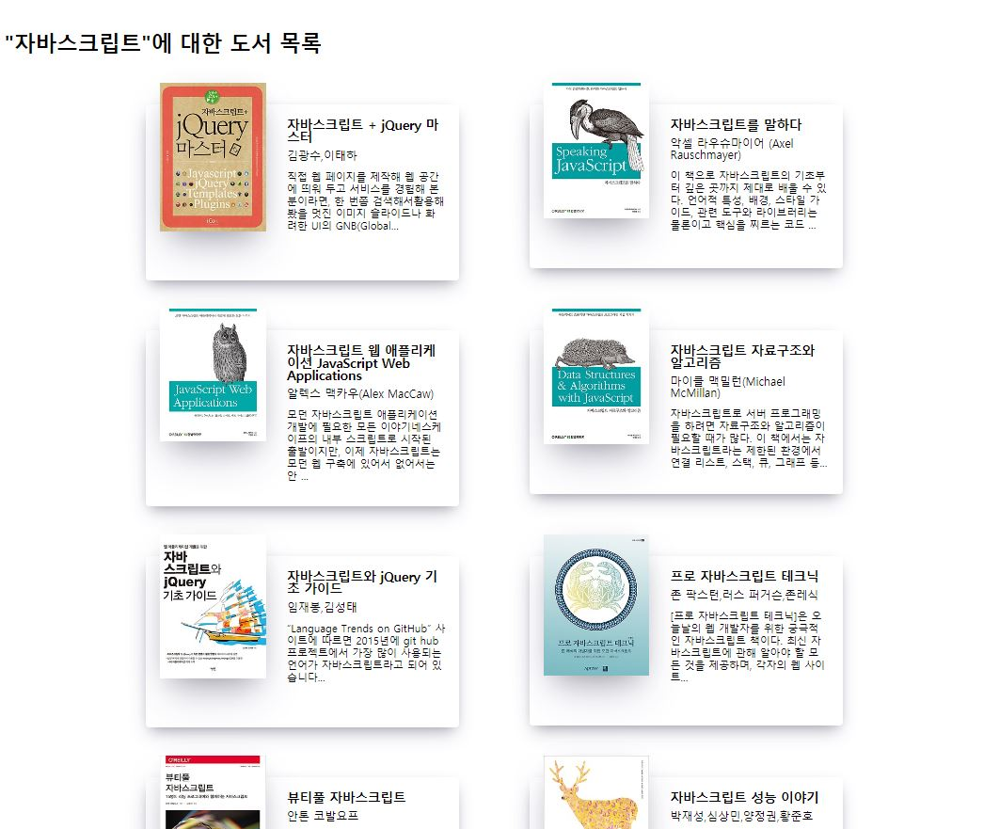

# Oh! Book(오! 북)
- 이메일 : brb1111@naver.com

## 프로젝트 소개
본 프로젝트를 시작한 계기는 제공하는 오픈 API를 통해 데이터를 직접 활용하면서 개인적인 실력을 기르고 싶었습니다. 그렇게 눈에 들어온 것이 도서 API였고, 유저가 읽거나 읽을 책에 대한 평가나 자신의 도서들을 즐겨찾기로 남길 수 있으면 좋겠다 싶어서 이 프로젝트를 진행했습니다.

### 프로젝트 사이트 링크
http://www.ohbook.site/

## 기술스택
### 클라이언트
- React(React-hooks)
- Redux
- Styled-Components
- Swiper

### 서버
- Node.js
- MongoDB
- Mongoose

### 배포
- AWS EC2(전체)
- Nginx(클라이언트)
- 도메인연결
- MongoDB Atals(DB 클라우드)

### 그 외 설정
- Git
- axios
- CRA(클라이언트)
- Babel(서버)
- Jsonwebtoken

### APIs
- 인터파크 도서 API

## 주요 기술을 활용한 기능들
+ 도서 슬라이드, 스와이프 기능
	+ API를 통한 도서 목록 3가지
	+ Swiper 모듈을 활용한 도서목록 자동 슬라이드
	+ Swiper 모듈을 활용한 도서목록 스와이프 기능

+ 도서 검색 기능
	+ 검색 API를 통한 도서 검색 기능

+ 로그인, 회원가입
    + React hook form 모듈을 활용한 Input, Form 조건 확인
    + 쿠키와 토큰을 활용한 Auth 기능
    + Redux를 활용한 로그인 유지 기능

+ 즐겨찾기 기능
	+ 책 세부내용에서 즐겨찾기 기능
	+ 즐겨찾기 페이지에서 즐겨찾기 목록확인
	+ React Popup모듈을 활용한 제목 클릭시 이미지 팝업

+ 댓글 기능
    + 책 상세페이지 내 댓글 기능

+ 보안적인 측면
	+ HOC(Higher Order Component)를 활용한 페이지 접근권한 설정
    	+ HOC 안의 Redux로 auth 미들웨어를 페이지 렌더링시 호출
	+ Redux를 활용한 로그인 유저만 댓글 및 즐겨찾기을 할 수 있도록 함.

+ 그밖의 기능
    + React-alert 모듈을 활용한 정보 및 오류 알림 기능

## 스크린샷
</img>
</img>
</img>
</img>
</img>
</img>
</img>

## 후기
강의만 보다가 긴가민가한 개념들을 직접 고민하면서 프로젝트에 구현하니까 개념이 많이 이해가 됐다. 그렇다고 완전 다 이해한 건 아니지만 전체적인 흐름이나 코드를 활용 할 수 있다는 자신감이 생겼다.
몇가지 아쉬운 점은 더 많은 기능과 코드의 완벽함을 가지고 싶었는 데 시간이 모자란 점이 컸다.
그리고 cors 에러 이건 진짜 마지막 배포까지 날 괴롭혀서 어후..
탈도 많고 오류도 많던 개인 프로젝트 Oh! Book 끝! (시간나면 기능추가 및 리팩토링)
