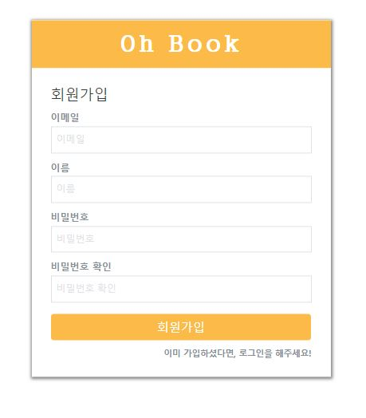

# Oh! Book(오! 북)
- 이메일 : brb1111@naver.com

## 프로젝트 소개
본 프로젝트를 시작한 계기는 제공하는 오픈 API를 통해 데이터를 직접 활용하면서 개인적인 실력을 기르고 싶었습니다. 그렇게 눈에 들어온 것이 도서 API였고, 유저가 읽거나 읽을 책에 대한 평가나 자신의 도서들을 즐겨찾기로 남길 수 있으면 좋겠다 싶어서 이 프로젝트를 진행했습니다. 

### 프로젝트 사이트 링크
http://www.ohbook.site/

## 기술스택
### 클라이언트
- React(React-hooks)
- Redux
- Styled-Components

### 서버
- Node.js
- MongoDB
- Mongoose

### 배포
- AWS EC2(전체)
- Nginx(클라이언트)
- 도메인연결
- MongoDB Atals(DB 클라우드)

### 그 외 설정
- Git
- axios
- CRA(클라이언트)
- Babel(서버)
- Jsonwebtoken

### APIs
- 인터파크 도서 API

## 주요 기술을 활용한 기능들
+ 도서 슬라이드, 스와이프 기능
	+ API를 통한 도서 목록 3가지
	+ Swiper 모듈을 활용한 도서목록 자동 슬라이드
	+ Swiper 모듈을 활용한 도서목록 스와이프 기능

+ 도서 검색 기능
	+ 검색 API를 통한 도서 검색 기능

+ 로그인, 회원가입
    + React hook form 모듈을 활용한 Input, Form 조건 확인
    + 쿠키와 토큰을 활용한 Auth 기능
    + Redux를 활용한 로그인 유지 기능

+ 즐겨찾기 기능
	+ 책 세부내용에서 즐겨찾기 기능
	+ 즐겨찾기 페이지에서 즐겨찾기 목록확인
	+ React Popup모듈을 활용한 제목 클릭시 이미지 팝업

+ 댓글 기능
    + 책 상세페이지 내 댓글 기능

+ 보안적인 측면
	+ HOC(Higher Order Component)를 활용한 페이지 접근권한 설정
    	+ HOC 안의 Redux로 auth 미들웨어를 페이지 렌더링시 호출
	+ Redux를 활용한 로그인 유저만 댓글 및 즐겨찾기을 할 수 있도록 함.

+ 그밖의 기능
    + React-alert 모듈을 활용한 정보 및 오류 알림 기능

## 스크린샷
</img>
</img>
</img>
</img>
</img>
</img>
</img>

## 배운 점
API 활용에 대한 무서움이 있었는 데 프로젝트를 진행하면서 자신감을 가질 수 있었습니다. React Hook Form, Swiper등 여러 모듈을 가져와 응용해서 쓰는 법을 배울 수 있었고, axios로 서버와 클라이언트간의 데이터, 쿠키를 보내줄 때 cors에러를 잡아주지 않으면 전송할 수 없다는 사실을 배웠습니다. 렌더링에 대한 완전한 개념은 아니지만 사용할 수 있을 정도의 개념을 익힐 수 있었습니다. Redux를 통해 로그인 상태를 관리하면서 Redux Flow를 알아갈 수 있었고, 마지막으로 배포 진행함으로써 도메인, 웹서버 등 여러 개념들을 찾아볼 수 있었습니다. 
구글링을 하면 할수록 코드에 대한 아쉬운 점을 볼 수 있었지만 현재는 리팩토링을 완전하게 못할 것 같아 다음 프로젝트를 진행하고나서 더 성장한 후 리팩토링해서 버전을 UP 시켜봐야겠다.

